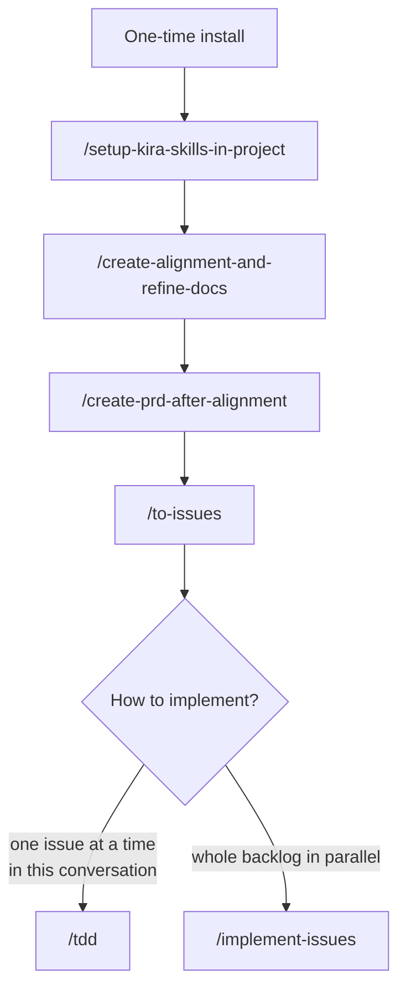

# Kira's Skills

Agent skills for real engineering work — small, composable slash commands and behaviours loaded by Claude Code.

These skills are adapted from [mattpocock/skills](https://github.com/mattpocock/skills), pruned and reshaped for solo use:

- Specs, PRDs, and implementation issues live in an external tracker — Jira or GitHub Issues — never in the source tree
- The only planning docs committed to the repo are the domain glossary (`CONTEXT.md`) and the ADRs (`docs/adr/`)
- No triage / label state machine

## Install

Pick one of the two install paths below — don't run both, or you'll end up with
duplicates of every skill loaded into Claude Code.

### Option A — Plugin (easiest, no clone)

Inside Claude Code:

```text
/plugin marketplace add yzlaboratory/skills
/plugin install kira-skills@kira-skills
```

Skills land in `~/.claude/plugins/cache/` and update via `/plugin marketplace update`.

### Option B — Copy from a clone

1. Clone the repo somewhere on your machine:

   ```sh
   git clone git@github.com:yzlaboratory/skills.git ~/Workspace/skills
   ```

2. Copy the skills into `~/.claude/skills/`:

   ```sh
   bash ~/Workspace/skills/scripts/install-skills.sh
   ```

   Re-run after pulling new changes — the install copies snapshots, not live links.

   > **Heads up — collisions are destructive.** For each skill in this repo, the
   > script removes any same-named entry already in `~/.claude/skills/` (file,
   > directory, or symlink) and replaces it with a fresh copy. If you already
   > have a `tdd/`, `create-prd-after-alignment/`, `to-issues/`, `zoom-out/`, or
   > `improve-codebase-architecture/` skill there, back them up first — the
   > script will not prompt before deleting them. Unrelated skills are left
   > alone.

## First-run setup (per project)

In any project where you want to use these skills, run `/setup-kira-skills-in-project`. It will:

- Ask which tracker the project uses — **Jira** (via the Atlassian MCP) or **GitHub Issues** (via `gh`)
- Write the `## Agent skills` block into your `CLAUDE.md`, recording the tracker, the branch-naming convention, and the in-repo domain docs

Specs, PRDs, and issues then live in that tracker; only `CONTEXT.md` and `docs/adr/` are committed to the repo.

You're ready to go.

## How the skills compose — end-to-end flow

The engineering skills are designed to chain. A typical flow from "I have an idea" to "the whole backlog is shipped":



**The shape of the chain:**

1. **Install once** — plugin or `install-skills.sh`. Repo-independent.
2. **`/setup-kira-skills-in-project`** — run once per repo. Picks the tracker mode and records it in `CLAUDE.md`.
3. **`/create-alignment-and-refine-docs`** — interview-style grilling that aligns you and the agent on terminology and scope. Creates (or receives) the feature ticket, writes the spec and out-of-scope list into it, and commits `CONTEXT.md` and `docs/adr/` changes to the repo.
4. **`/create-prd-after-alignment`** — synthesise a PRD from the alignment session and write it into the feature ticket, alongside the spec and out-of-scope list.
5. **`/to-issues`** — slice the feature ticket's PRD into tracer-bullet issues, published as child issues (GitHub sub-issues / Jira Subtasks) of the feature ticket.
6. **Implement** — pick one:
   - **`/tdd`** in this same conversation, one issue at a time.
   - **`/implement-issues`** to fan the whole backlog out to parallel `/tdd` subagents, each working in its own git worktree. Invoking the skill is the approval — waves spawn automatically as blockers clear, with no per-wave gate.

Once a feature's PR merges to `main`, its feature ticket and issues are stale — nothing closes them automatically.

## What each skill solves

### Misalignment between you and the agent

Agents guess at what you want. The fix is a structured grilling session that interviews you until each branch of the design tree is resolved.

- [`/create-alignment-and-refine-docs`](./skills/engineering/create-alignment-and-refine-docs/SKILL.md) — grilling session that writes the spec into the feature ticket and updates `CONTEXT.md` and ADRs inline as decisions crystallise

### Verbose, jargon-blind agents

Agents drop into a project and use 20 words where 1 will do. A shared domain language fixes that — and makes the codebase easier for them to navigate, with consistently named identifiers and fewer thinking tokens spent.

This is built into [`/create-alignment-and-refine-docs`](./skills/engineering/create-alignment-and-refine-docs/SKILL.md): every resolved term goes into `CONTEXT.md` immediately. Hard-to-reverse architectural decisions get an ADR under `docs/adr/`.

### Code that doesn't work

When you and the agent are aligned but the code still breaks, you need feedback loops: types, browser access, automated tests.

- [`/tdd`](./skills/engineering/tdd/SKILL.md) — red-green-refactor loop with guidance on good vs bad tests
- [`/diagnose`](./skills/engineering/diagnose/SKILL.md) — disciplined diagnosis: reproduce → minimise → hypothesise → instrument → fix → regression-test

### A whole backlog to burn down

When a feature ticket has a backlog of child issues (typically produced by `/to-issues`) and you want them all implemented without babysitting each one.

- [`/implement-issues`](./skills/engineering/implement-issues/SKILL.md) — orchestrates parallel `/tdd` subagents, one per issue per wave, each in its own worktree. Invoking the skill is the approval; waves spawn automatically as blockers clear, with no per-wave gate.

### Architectural drift

Agents accelerate software entropy. The counterweight is investing in design every day.

- [`/create-prd-after-alignment`](./skills/engineering/create-prd-after-alignment/SKILL.md) — synthesises a PRD from the alignment session into the feature ticket
- [`/zoom-out`](./skills/engineering/zoom-out/SKILL.md) — tells the agent to explain code in the context of the whole system
- [`/improve-codebase-architecture`](./skills/engineering/improve-codebase-architecture/SKILL.md) — rescue a codebase that's become a ball of mud (run every few days)

## Reference

### Engineering

- **[create-alignment-and-refine-docs](./skills/engineering/create-alignment-and-refine-docs/SKILL.md)** — Grilling session that challenges your plan against the existing domain model, sharpens terminology, writes the spec into the feature ticket, and updates `CONTEXT.md` and ADRs inline.
- **[create-prd-after-alignment](./skills/engineering/create-prd-after-alignment/SKILL.md)** — Synthesise a PRD from the just-completed alignment session — the ADRs you confirmed, the spec you authored, and the implementation decisions that crystallised — and write it into the feature ticket. No fresh interview; this skill is the natural follow-up to `/create-alignment-and-refine-docs`.
- **[diagnose](./skills/engineering/diagnose/SKILL.md)** — Disciplined diagnosis loop for hard bugs and performance regressions: reproduce → minimise → hypothesise → instrument → fix → regression-test.
- **[implement-issues](./skills/engineering/implement-issues/SKILL.md)** — Orchestrate parallel implementation of every child issue under a feature ticket: spawns one `/tdd` subagent per issue per wave, each in its own worktree, respecting `Blocked by` dependencies until the whole backlog is done. Invoking the skill is the approval — waves spawn automatically as blockers clear, with no per-wave gate. Takes the feature ticket, or derives it from the current branch.
- **[improve-codebase-architecture](./skills/engineering/improve-codebase-architecture/SKILL.md)** — Find deepening opportunities in a codebase, informed by the domain language in `CONTEXT.md` and the decisions in `docs/adr/`.
- **[setup-kira-skills-in-project](./skills/engineering/setup-kira-skills-in-project/SKILL.md)** — Pick the project's tracker mode (Jira or GitHub Issues) and write the `## Agent skills` block into `CLAUDE.md` that the other engineering skills consume. Run once per repo before using `create-alignment-and-refine-docs`, `create-prd-after-alignment`, `to-issues`, `implement-issues`, `diagnose`, `tdd`, `improve-codebase-architecture`, or `zoom-out`.
- **[tdd](./skills/engineering/tdd/SKILL.md)** — Test-driven development with a red-green-refactor loop. Builds features or fixes bugs one vertical slice at a time.
- **[to-issues](./skills/engineering/to-issues/SKILL.md)** — Break a feature ticket's PRD into independently-grabbable issues using vertical slices, published as child issues of the feature ticket. Takes the feature ticket, or derives it from the current branch.
- **[zoom-out](./skills/engineering/zoom-out/SKILL.md)** — Tell the agent to zoom out and give broader context or a higher-level perspective on an unfamiliar section of code.
